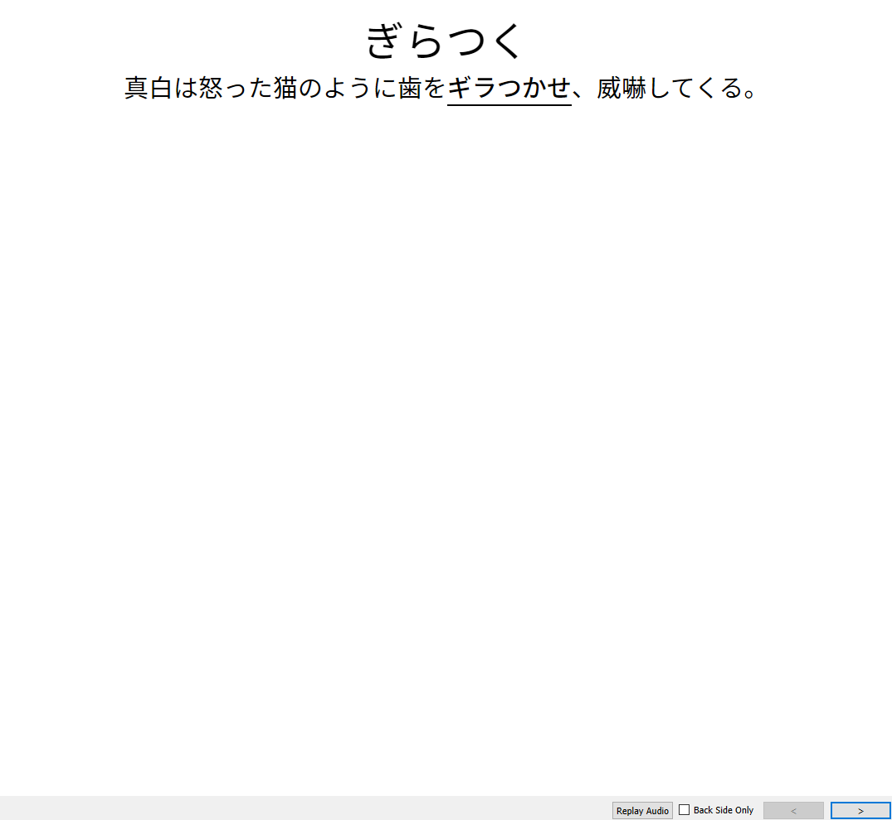
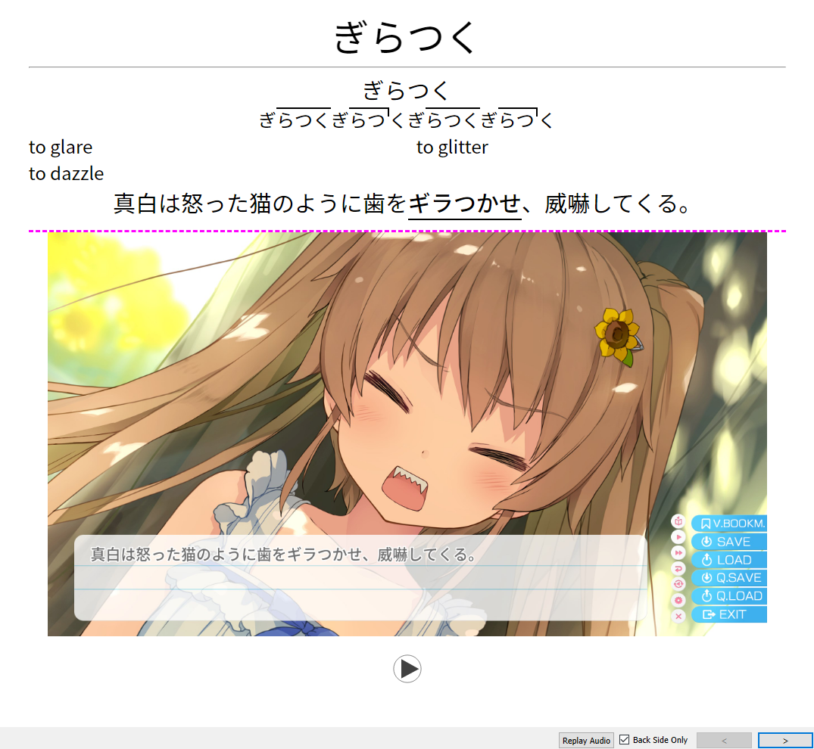

# JP Resources <!-- omit in toc -->

### Check out these [Yomichan dictionaries](https://github.com/MarvNC/yomichan-dictionaries/)

My contributions to the Japanese learning community. For questions and support, please make a thread in the questions forum [in TheMoeWay](https://learnjapanese.moe/join/). For suggestions please mention @Marv.

### [Changelog](changelog.md) <!-- omit in toc -->

- [Contribution](#contribution)
- [Other Resources](#other-resources)
  - [Dictionaries](#dictionaries)
  - [Special Thanks](#special-thanks)
- [Frequency Dictionaries](#frequency-dictionaries)
- [Sorting Mined Anki Cards by Frequency](#sorting-mined-anki-cards-by-frequency)
  - [How-To](#how-to)
    - [`freq` Handlebar](#freq-handlebar)
  - [`freq` Settings](#freq-settings)
  - [Usage](#usage)
  - [Backfilling Old Cards](#backfilling-old-cards)
  - [Fitting in Cards Without Frequencies](#fitting-in-cards-without-frequencies)
- [Anki Card Blur](#anki-card-blur)
  - [How-To](#how-to-1)
  - [Usage](#usage-1)
    - [Default to Enabled/Disabled](#default-to-enableddisabled)
  - [Non Persistent/NoJS Version](#non-persistentnojs-version)
  - [ShareX Hotkey for NSFW cards](#sharex-hotkey-for-nsfw-cards)
- [Anki Automatically Highlight in Sentence](#anki-automatically-highlight-in-sentence)
- [Anki Automatic Hint Sentence for Kana Cards](#anki-automatic-hint-sentence-for-kana-cards)
- [Yomichan Text Replacement Patterns](#yomichan-text-replacement-patterns)

## Contribution

Contributions are welcome, feel free to open a pull request. Note that there is a [Prettier](https://prettier.io/) config file in the repo for auto formatting with the extension.

In addition, the [Markdown All in One](https://marketplace.visualstudio.com/items?itemName=yzhang.markdown-all-in-one) extension can be used to automatically generate and update a table of contents as well as assist in markdown editing.

## Other Resources

- [JP resources by Aquafina water bottle](https://aquafina-water-bottle.github.io/jp-mining-note/jpresources/) and a [very promising Anki note template](https://aquafina-water-bottle.github.io/jp-mining-note/).
- [arujisho](https://github.com/emc2314/arujisho) - the BEST android dictionary.

### Dictionaries

These are absolutely essential.

- [Grammar Dictionaries](https://github.com/aiko-tanaka/Grammar-Dictionaries)
- [JMDict Surface Forms](https://github.com/FooSoft/yomichan/issues/2183)
- [Much less bloated JMnedict](https://github.com/FooSoft/yomichan/issues/2111#issuecomment-1192238540)

### Special Thanks

Much thanks to:

- Renji-xD for rewriting the handlebar to find a minimum value.
- KamWithK for developing cool Anki addons to use with this guide.
- Aquafina-water-bottle for developing a python script that greatly improved the backfilling process and much handlebar wizardry to revamp the frequency handlebar.
- GrumpyThomas, pj, and aka_baka for some suggestions.

## Frequency Dictionaries

I sometimes get asked about what frequency dictionaries to use and the differences between them, so here are a few essential dictionaries I would recommend.

- **[JPDB](https://github.com/MarvNC/yomichan-dictionaries/#jpdb-frequency-dictionary)**
  - Frequency data scraped from https://jpdb.io in May of 2022. Due to the way the data was scraped, some terms are missing frequencies and the jpdb dictionary itself is limited to terms in JMDict. For example, 経緯 only has an entry for the いきさつ reading so it should not be used as a dictionary for sorting (the more common/correct reading is けいい). The corpus of JPDB is quite good for immersion learners as it covers anime, dramas, light novels, visual novels, and web novels so the frequencies will be relatively accurate to what you're actually reading. This dictionary is notable for displaying the frequencies of kana readings separately, so you can often get a sense of how often a word is written with kanji or not.
- **[Innocent Ranked](https://learnjapanese.moe/resources/#dictionaries)**
  - The Innocent Corpus from the [Yomichan page](https://github.com/FooSoft/yomichan#dictionaries) but reordered to be sorted by rank. It is based on data [from 5000+ novels](https://web.archive.org/web/20190309073023/https://forum.koohii.com/thread-9459.html#pid168613). A weakness is that it does not differentiate based on reading, so all readings of a term will show the same value.
- **[BCCWJ](https://github.com/toasted-nutbread/yomichan-bccwj-frequency-dictionary/releases)**
  - From the [publication](https://link.springer.com/article/10.1007/s10579-013-9261-0):
  - > The balanced corpus of contemporary written Japanese (BCCWJ) is Japan’s first 100 million words balanced corpus. It consists of three subcorpora (publication subcorpus, library subcorpus, and special-purpose subcorpus) and covers a wide range of text registers including books in general, magazines, newspapers, governmental white papers, best-selling books, an internet bulletin-board, a blog, school textbooks, minutes of the national diet, publicity newsletters of local governments, laws, and poetry verses.
  - It has extremely wide coverage with most terms you'll encounter having an entry in this list even if other frequency lists don't. In addition, it differentiates between readings quite well. Make sure to install the LUW version as it has more terms.
- **[CC100](https://learnjapanese.moe/resources/#dictionaries)**
  - Made by the mind behind [arujisho](https://github.com/emc2314/arujisho), this uses the [CC100 dataset](https://data.statmt.org/cc-100/) which was made by crawling the web. Coverage is very wide, and there is reason behind the way readings are differentiated which is why I use this as my Yomichan sort dictionary.

## Sorting Mined Anki Cards by Frequency

When reading and adding cards from the content you're reading, you'll come across a variety of words with varying degrees of usefulness. Especially as a beginner, you'll want to learn the useful words as soon as possible and learn the less useful words later. With this we can sort a backlog of mined cards by frequency using various installed Yomichan frequency lists.

This handlebar for Yomichan will add a `{freq}` field that will use your installed frequency dictionaries to send a numerical frequency value to Anki depending on the [sort option applied](#freq-settings), with the default being the (recommended) harmonic mean.

### How-To

- First, in your Anki card template create a new field for frequency, we can name this `Frequency` or whatever you like.

  

- Then in Yomichan options, insert the following handlebars code at the end of the menu in `Configure Anki card templates...`.

  

  #### `freq` Handlebar

  ```handlebars
  {{#*inline "freq"}}
      {{~! Frequency sort handlebars: v23.03.13.1 ~}}
      {{~! The latest version can be found at https://github.com/MarvNC/JP-Resources#freq-handlebar ~}}
      {{~#scope~}}
          {{~! Options ~}}
          {{~#set "opt-ignored-freq-dict-regex"~}} ^(JLPT_Level)$ {{~/set~}}
          {{~#set "opt-ignored-freq-value-regex"~}} ❌ {{~/set~}}
          {{~#set "opt-keep-freqs-past-first-regex"~}} ^()$ {{~/set~}}
          {{~set "opt-no-freq-default-value" 9999999 ~}}
          {{~set "opt-freq-sorting-method" "harmonic" ~}} {{~! "min", "first", "avg", "harmonic" ~}}

          {{~set "opt-grammar-override" true ~}}
          {{~set "opt-grammar-override-value" 0 ~}}
          {{~#set "opt-grammar-override-dict-regex"~}} ^(日本語文法辞典\(全集\)|毎日のんびり日本語教師|JLPT文法解説まとめ|どんなときどう使う 日本語表現文型辞典|絵でわかる日本語)$ {{~/set~}}
          {{~! End of options ~}}

          {{~! Do not change the code below unless you know what you are doing. ~}}
          {{~set "result-freq" -1 ~}} {{~! -1 is chosen because no frequency dictionaries should have an entry as -1 ~}}
          {{~set "prev-freq-dict" "" ~}}
          {{~set "t" 1 ~}}
          {{~set "found-grammar-dict" false ~}}

          {{~! search for grammar dictionary ~}}
          {{~#each definition.definitions~}}
              {{~#set "rx-match-grammar-dicts" ~}}
                  {{~#regexMatch (get "opt-grammar-override-dict-regex") "u"~}}{{this.dictionary}}{{~/regexMatch~}}
              {{/set~}}
              {{~! rx-match-grammar-dicts is not empty if a grammar dictionary was found ~}}
              {{~#if (op "!==" (get "rx-match-grammar-dicts") "") ~}}
                  {{~set "found-grammar-dict" true ~}}
              {{/if~}}
          {{~/each~}}

          {{~! Additional case when "Result grouping mode" is set to "No Grouping"~}}
          {{~#set "rx-match-grammar-dicts" ~}}
              {{~#regexMatch (get "opt-grammar-override-dict-regex") "u"~}}{{this.definition.dictionary}}{{~/regexMatch~}}
          {{/set~}}
          {{~! rx-match-grammar-dicts is not empty if a grammar dictionary was found ~}}
          {{~#if (op "!==" (get "rx-match-grammar-dicts") "") ~}}
              {{~set "found-grammar-dict" true ~}}
          {{/if~}}

          {{~#each definition.frequencies~}}

              {{~! rx-match-ignored-freq is not empty if ignored <=> rx-match-ignored-freq is empty if not ignored ~}}
              {{~#set "rx-match-ignored-freq" ~}}
                  {{~#regexMatch (get "opt-ignored-freq-dict-regex") "u"~}}{{this.dictionary}}{{~/regexMatch~}}
              {{/set~}}

              {{~#set "rx-match-ignored-value" ~}}
                  {{~#regexMatch (get "opt-ignored-freq-value-regex") "u"~}}{{this.frequency}}{{~/regexMatch~}}
              {{/set~}}
              {{~#if (op "&&" (op "===" (get "rx-match-ignored-freq") "") (op "===" (get "rx-match-ignored-value") ""))~}}

                  {{~!
                      only uses the 1st frequency of any dictionary.
                      For example, if JPDB lists 440 and 26189㋕, only the first 440 will be used.
                  ~}}
                  {{~set "read-freq" false ~}}
                  {{~#if (op "!==" (get "prev-freq-dict") this.dictionary ) ~}}
                      {{~set "read-freq" true ~}}
                      {{~set "prev-freq-dict" this.dictionary ~}}
                  {{/if~}}

                  {{~#if (op "!" (get "read-freq") ) ~}}
                      {{~#set "rx-match-keep-freqs" ~}}
                          {{~#regexMatch (get "opt-keep-freqs-past-first-regex") "u"~}}{{this.dictionary}}{{~/regexMatch~}}
                      {{/set~}}

                      {{~! rx-match-keep-freqs is not empty if keep freqs ~}}
                      {{~#if (op "!==" (get "rx-match-keep-freqs") "") ~}}
                          {{~set "read-freq" true ~}}
                      {{/if~}}
                  {{/if~}}

                  {{~#if (get "read-freq") ~}}
                      {{~set "f" (op "+" (regexMatch "\d+" "" this.frequency)) ~}}

                      {{~#if (op "===" (get "opt-freq-sorting-method") "min") ~}}
                          {{~#if
                              (op "||"
                                  (op "===" (get "result-freq") -1)
                                  (op ">" (get "result-freq") (get "f"))
                              )
                          ~}}
                              {{~set "result-freq" (op "+" (get "f")) ~}}
                          {{~/if~}}

                      {{~else if (op "===" (get "opt-freq-sorting-method") "first") ~}}
                          {{~#if (op "===" (get "result-freq") -1) ~}}
                              {{~set "result-freq" (get "f") ~}}
                          {{~/if~}}

                      {{~else if (op "===" (get "opt-freq-sorting-method") "avg") ~}}

                          {{~#if (op "===" (get "result-freq") -1) ~}}
                              {{~set "result-freq" (get "f") ~}}
                          {{~else~}}
                              {{~!
                                  iterative mean formula (to prevent floating point overflow):
                                      $S_{(t+1)} = S_t + \frac{1}{t+1} (x - S_t)$
                                  - example java implementation: https://stackoverflow.com/a/1934266
                                  - proof: https://www.heikohoffmann.de/htmlthesis/node134.html
                              ~}}
                              {{~set "result-freq"
                                  (op "+"
                                      (get "result-freq")
                                      (op "/"
                                          (op "-"
                                              (get "f")
                                              (get "result-freq")
                                          )
                                          (get "t")
                                      )
                                  )
                              }}
                          {{~/if~}}
                          {{~set "t" (op "+" (get "t") 1) ~}}

                      {{~else if (op "===" (get "opt-freq-sorting-method") "harmonic") ~}}
                          {{~#if (op ">" (get "f") 0) ~}} {{~! ensures only positive numbers are used ~}}
                              {{~#if (op "===" (get "result-freq") -1) ~}}
                                  {{~set "result-freq" (op "/" 1 (get "f")) ~}}
                              {{~else ~}}
                                  {{~set "result-freq"
                                      (op "+"
                                          (get "result-freq")
                                          (op "/" 1 (get "f"))
                                      )
                                  }}
                                  {{~set "t" (op "+" (get "t") 1) ~}}
                              {{~/if~}}
                          {{~/if~}}

                      {{~else if (op "===" (get "opt-freq-sorting-method") "debug") ~}}

                          {{ this.dictionary }}: {{ this.frequency }} -> {{ get "f" }} <br>

                      {{~else~}}
                          (INVALID opt-freq-sorting-method value)
                      {{~/if~}}

                  {{~/if~}}

              {{~/if~}}

          {{~/each~}}

          {{~! (x) >> 0 apparently floors x: https://stackoverflow.com/a/4228528 ~}}
          {{~#if (op "===" (get "result-freq") -1) ~}}
              {{~set "result-freq" (get "opt-no-freq-default-value") ~}}
          {{~ else if (op "===" (get "opt-freq-sorting-method") "avg") ~}}
              {{~set "result-freq"
                  (op ">>" (get "result-freq") 0 )
              ~}}
          {{~ else if (op "===" (get "opt-freq-sorting-method") "harmonic") ~}}
              {{~set "result-freq"
                  (op ">>"
                      (op "*"
                          (op "/" 1 (get "result-freq"))
                          (get "t")
                      )
                      0
                  )
              ~}}
          {{~/if~}}

          {{~! override final result if grammar dictionary ~}}
          {{~#if (
              op "&&"
                  (op "===" (get "found-grammar-dict") true)
                  (op "===" (get "opt-grammar-override") true)
              )
          ~}}
              {{~set "result-freq" (get "opt-grammar-override-value") ~}}
          {{/if}}

          {{~get "result-freq"~}}
      {{~/scope~}}
  {{/inline}}
  ```

- In `Configure Anki card format...`, we may need to refresh the card model for the new field to show up.
  - To do this, change the model to something else and change it back.
  - ⚠️**This will clear your fields, so take a screenshot to remember what you had.**
    - You can try duplicating your card model in Anki and switching to/from that model, so hopefully your card fields will remain.
- When your frequency field shows up, **type in** `{freq}` in its value box to use the handlebar.


### `freq` Settings

The default settings within the `freq` handlebars code should work for most people.
However, it can be customized if desired.
To access the settings, head back to Yomichan's templates (Yomichan options → `Anki` → `Configure Anki card templates...`),
and view the lines right below `{{#*inline "freq"}}`.

<details>
<summary><b>Ignoring Frequency Dictionaries</b></summary>

- By default, `JLPT_Level` is ignored. If you want to ignore other dictionaries,
  edit the `opt-ignored-freq-dict-regex` variable and join the dictionary names with `|`.
  For example, to ignore `My amazing frequency dictionary`, do the following:

  ```handlebars
  {{~#set 'opt-ignored-freq-dict-regex'~}} ^(JLPT_Level|My amazing frequency dictionary)$ {{~/set~}}
  ```

</details>

<details>
<summary><b>Ignoring Frequency Values</b></summary>

- By default, any frequency value containing `❌` is ignored as it represents a value that does not appear in JPDB.
  If you want to ignore other values, edit the `opt-ignored-freq-value-regex` variable and join the ignored symbols with `|`.
  For example, to also ignore entries containing a `⚠` symbol, do the following:

  ```handlebars
  {{~#set 'opt-ignored-freq-value-regex'~}} ❌|⚠ {{~/set~}}
  ```

- If you do not wish to ignore any values, remove the ❌ symbol from the regex.

  ```handlebars
  {{~#set 'opt-ignored-freq-value-regex'~}}{{~/set~}}
  ```

</details>

<details>
<summary><b>Default Value For No Frequencies</b></summary>

- When no frequencies are listed for the expression, the default value given is `9999999`. This puts the card at the very end of the queue.

  Some users may prefer setting the default value to 0, as it would be a conscious decision to add
  a term without a frequency value and you may want to prioritize learning the term immediately.
  To do this, change the `opt-no-freq-default-value` variable.
  For example:

  ```handlebars
  {{~set 'opt-no-freq-default-value' 0~}}
  ```

</details>

<details>
<summary><b>Default Value For Grammar Dictionaries</b></summary>

- By default, if you create a card for any grammar point,
  the frequency will be automatically set to `0`.
  This is because it is very likely that
  you would want to prioritize reviewing grammar points as much as possible.

  The `{freq}` handlebars code determines whether a card is a grammar point or not by
  your installed [grammar dictionaries](https://github.com/aiko-tanaka/Grammar-Dictionaries).
  If the definition within the exported term contains any grammar dictionary,
  then it is considered as a grammar point. Otherwise, the term is treated
  like any other term.

  > **Note**:
  > This may incorrectly override the frequency for some terms that might not be considered as a grammar point.
  > For example, 以前 can be used as a standalone word, but is an entry under the **毎日のんびり日本語教師** dictionary.
  > In other words, with this feature enabled, 以前 will have its `{freq}` value incorrectly overwritten (to 0 by default).
  >
  > This incorrect override usually only happens for very common words anyways
  > (JPDB ranks 以前 as 721), so this should not be a very big problem.

  The following table summarizes the options related to this.

  | Option                            | Description                                                                                                                                                                                                                         |
  | --------------------------------- | ----------------------------------------------------------------------------------------------------------------------------------------------------------------------------------------------------------------------------------- |
  | `opt-grammar-override`            | If set to `true` (default), overrides the resulting frequency with `opt-grammar-override-value` if at least one dictionary is determined to be a grammar dictionary. Set this variable to `false` in order to disable the behavior. |
  | `opt-grammar-override-value`      | The exact frequency value used for grammar dictionaries.                                                                                                                                                                            |
  | `opt-grammar-override-dict-regex` | The regex used in order to determine if a dictionary is a grammar dictionary. Edit this like any other `dict-regex` variable, i.e. by concatenating strings with `\|`.                                                              |

</details>

<details>
<summary><b>Sorting Method</b></summary>

- The sorting method determines the resulting value of `{freq}`.
  By default, the harmonic frequency is chosen.
  This can be modified by changing `opt-freq-sorting-method`, e.g.

  ```handlebars
  {{~set 'opt-freq-sorting-method' 'first'~}}
  ```

  The following table shows the available sorting methods. Note that these are case sensitive!

  | Sorting Method | Description                                                                                                                                                                                                                                                        |
  | -------------- | ------------------------------------------------------------------------------------------------------------------------------------------------------------------------------------------------------------------------------------------------------------------ |
  | `min`          | Gets the smallest frequency available.                                                                                                                                                                                                                             |
  | `first`        | Gets the first frequency listed in Yomichan. <br> The order of frequency dictionaries is determined by the `Priority` column under Yomichan settings → `Configure installed and enabled dictionaries...`. Dictionaries are sorted from highest to lowest priority. |
  | `avg`          | Gets the average (i.e. the [arithmetic mean](https://en.wikipedia.org/wiki/Arithmetic_mean)) of the frequencies.                                                                                                                                                   |
  | `harmonic`     | Gets the [harmonic mean](https://en.wikipedia.org/wiki/Harmonic_mean) of the frequencies, which can be thought of as an in-between of `min` and `avg`. See below for more details. This is the default value.                                                      |
  | `debug`        | Internal mode to shows the dictionaries and frequencies for each dictionary, after being filtered from `opt-ignored-freq-dict-regex` and `opt-keep-freqs-past-first-regex`. Useful when testing the aforementioned regexes.                                        |

  The harmonic mean has the following properties that may make it more attractive to use over `avg`:

  - "The harmonic mean of a list of numbers tends strongly toward the least elements of the list."[^1]
    In other words, a frequency dictionary with an abnormally large value will not greatly
    affect the resulting value.
    Conversely, a frequency dictionary with an abnormally small value will affect the resulting
    value more than `avg`, but still less so than simply using `min`.
  - The harmonic mean is always greater than (or equal) to the minimum number and always less than
    (or equal) to the arithmetic mean.[^2]

  This makes `harmonic` ideal for people who want a statistic that takes into account all numbers,
  but does not arbitrarily deviate due to large outliers (which `avg` can easily do).

  [^1]: https://en.wikipedia.org/wiki/Harmonic_mean#Relationship_with_other_means
  [^2]: https://en.wikipedia.org/wiki/Pythagorean_means#Inequalities_among_means

</details>

<details>
<summary><b>Reading Multiple Frequencies from the Same Dictionary</b></summary>

- Some frequency dictionaries have multiple numbers displayed.
  Among these dictionaries, there are two ways that these these can be stored:

  1. The frequency is stored as one string. For example, with 青空文庫熟語,
     the frequency is "160 (5406)".
     Only the first number (160) can be grabbed from this, and any numbers past this
     _cannot be received_ without hacking the code.
  2. The frequency is stored as multiple strings. For example with JPDB,
     the frequency for 読む is stored as "440" and "26189 ㋕"
     (with the latter being read as _21689_).

     By default, only the first number (_440_) will be considered in the sorting method.
     If you want the sorting method to also consider other numbers (such as _26189_),
     add the desired dictionary to the `opt-keep-freqs-past-first-regex` variable,
     similarly to how dictionaries are added to `opt-ignored-freq-dict-regex`
     (concatenated with `|`).

     For example, adding JPDB to the variable will result in the following:

     ```handlebars
     {{~#set 'opt-keep-freqs-past-first-regex'~}} ^(JPDB)$ {{~/set~}}
     ```

     And adding JPDB VN3 万 as well will result in the following:

     ```handlebars
     {{~#set 'opt-keep-freqs-past-first-regex'~}} ^(JPDB|JPDB VN3万)$ {{~/set~}}
     ```

</details>

### Usage

Use the [AnkiAutoReorder](https://ankiweb.net/shared/info/757527607) addon to have your backlog sort automatically on refresh.

- Enter your search query (`search_to_sort`) and your `sort_field` into the addon's config (`Tools > Addons > AutoReorder > Config`).
  - You can get the appropriate search query by going to the Browse window, then ctrl click your deck name and the "New" card state. The string at the top is the search query you can use in the addon settings, it should have the deck name and `is:new`.
- Then reorder your deck by frequency from `Tools > Reposition Cards`. Remember to do this every day after adding new cards.

_2022-10-21_20-48-50.png>)

I also recommend installing the [Advanced Browser](https://ankiweb.net/shared/info/874215009) addon to display the frequency field in Anki's browse page.

Below: right click the column headers at the top with Advanced Browser installed to select new fields to be displayed.

_2022-07-10_10-22-41.png>)

Alternatively, after installing Advanced Browser, you could sort by the frequency field and press `ctrl + a` then `ctrl + shift + s` to select all cards and reorder.

### Backfilling Old Cards

If you already have a large backlog of old cards without frequency values, you might need to fill in these values first or they won't be sorted. There are two methods listed below to do exactly that. The command line method runs much faster than the Anki method, but requires some command line knowledge to pull off.

Of course, you could just opt to finish reviewing these cards first instead of backfilling the old cards.

> **Warning**: **Make sure to backup your collection** before trying either method below.

<details>
<summary><b>Backfilling: Command Line (Recommended)</b></summary>

- Install the latest version of [Python](https://www.python.org/downloads/) if you do not have it already installed. Any Python version 3.8 or above should work.
- Install [AnkiConnect](https://ankiweb.net/shared/info/2055492159) if you do not have it already installed.
- Open Anki. If you just installed AnkiConnect, make sure to restart Anki so AnkiConnect is properly running.
  - Note that this will not work via [WSL](https://learn.microsoft.com/en-us/windows/wsl/install) due to networking constraints. If you are on Windows you will have to use Command Prompt or Powershell.
- Run the following commands:

  ```bash
  git clone "https://github.com/MarvNC/JP-Resources.git"
  cd JP-Resources
  cd frequency

  # Linux users might have to use `python3` instead of `python`.
  # Replace "Expression" with the exact field name that contains the word/expression.
  python backfill.py "Expression"
  ```

  Here are some more examples on how to use `backfill.py`:

  ```bash
  # View all possible arguments.
  python backfill.py --help

  # Searches for the expression in the field "Word" instead of "Expression"
  # Note that this is case sensitive!
  python backfill.py "Word"

  # Sets all expressions without any found frequencies to the default value of '0'.
  python backfill.py "Expression" --default 0

  # Uses the field "FrequencySort" instead of the default ("Frequency").
  # This also changes the default query to search an empty `FrequencySort` field.
  python backfill.py "Expression" --freq-field "FrequencySort"

  # Uses a custom query instead of the default ("Expression:* Frequency:").
  # Note: For powershell users, you must escape the quotes with an additional backtick:
  #     --query "Frequency: \`"note:My mining note\`""
  python backfill.py "Expression" --query "Frequency: \"note:My mining note\""

  # This custom query can be used to override all of your existing frequencies,
  # instead of just backfilling. RUN THIS WITH CAUTION!
  python backfill.py "Expression" --query "\"note:My mining note\""

  # Changes the order of which frequency list is used first.
  python backfill.py "Expression" --freq-lists "vnsfreq.txt" "JPDB.txt"
  ```

</details>

<details>
<summary><b>Backfilling: Within Anki</b></summary>

- This is a hacky method to backfill your old cards. Again, **make sure to backup your collection before attempting this, it could cause significant lag to your Anki.** In addition, for users of Anki 2.1.50+ [increase your backup interval](https://docs.ankiweb.net/backups.html?highlight=backup#anki-2150) before attempting the import as it will take a _long_ time. A backup occurring while you're waiting on Anki to delete cards will just cause more lag.

- Create a frequency list in `.txt` format that contains a list of expressions followed by frequency values. You can use the ones I have created [here](frequency), I recommend downloading the [JPDB](frequency/JPDB.txt) list as it's the most exhaustive. However the [VN Stars](frequency/vnsfreqSTARS.txt) list also fills in some of the gaps that JPDB doesn't cover, so you could import it first, then import JPDB afterward for maximum frequency coverage.

- In Anki, create a new temporary deck and move your backlogged cards to the new deck, then tag them for later.

  - Search for the backlogged new cards using `deck:{deckname} is:new` in your card browser, then hit `ctrl + a` to select them all then `ctrl + d` to bring up the "Change Deck" menu from which you can create a new deck (named `temp` or whatever you like) and move them.
  - Select this new deck, then tag them using `ctrl + a` then `ctrl + shift + a` to add a new tag, where you can type in something like `backlog`.

- With this temporary deck selected, go to File -> Import, then select the txt frequency list. Map the first field to your term/expression field, then the second field to your frequency field. **Make sure to enable "Update existing notes when first field matches."** Then import it to your temporary deck.

  

- This will update your existing notes' frequency values, but it'll also import a LOT of new unneeded cards.

  - Search for your backlogged cards using `tag:backlog` and then again hit `ctrl + a` then `ctrl + d` to move them back to your vocabulary deck. Now we can simply delete the temporary deck along with the all the new cards that were added, just **make sure** you aren't deleting any actual cards first.

- Finally, you can right click the `backlog` tag in the sidebar and delete it.

</details>

### Fitting in Cards Without Frequencies

If you frequently make cards that don't contain frequencies, such as sentence or grammar cards, you won't be able to pull frequencies from dictionaries. If you tag all of these cards specifically, you can use [this plugin](https://github.com/HunterKing/anki-frequency-shuffle) to generate random frequencies for these cards.

## Anki Card Blur

When adding cards from VNs, we might find some risque content that we still want to look at while reviewing because it's cute. However, you might review in places where you don't always want other people to see your cards. Using this card template, we can blur media in Anki and have the option persist throughout a review session.

|  x   | Blur disabled                                    | Blur enabled                                     |
| :--: | ------------------------------------------------ | ------------------------------------------------ |
| SFW  |  |  |
| NSFW |  |  |

Media: ハミダシクリエイティブ © まどそふと

### How-To

- Decide on a tag for NSFW cards. I use `-NSFW` so the tag is sorted first for easy access. If you choose something else you'll need to replace all instances of `-NSFW` in this guide with your tag name (with `ctrl + h` in a text editor or an [online tool](http://www.unit-conversion.info/texttools/replace-text/)).

- Tag your NSFW cards with this tag in Anki (see [ShareX Hotkey](#sharex-hotkey-for-nsfw-cards)).

- Download the anki-persistence script (`minified.js` or `script.js`) from [here](https://github.com/SimonLammer/anki-persistence/releases/tag/v1.0.0). Then rename it `__persistence.js` and place it in your Anki [user/media folder](https://docs.ankiweb.net/files.html#file-locations).

#### Card Template/Code <!-- omit in toc -->

- In your card template where you want the image to go, paste in this HTML, renaming `{{Picture}}` to match the name of the field that contains your media.

```html
<div id="main_image" class="{{Tags}}">
  <a onclick="toggleNsfw()">{{Picture}}</a>
</div>
```

- Then, at the end of the template paste in this code:

```html
<script src="__persistence.js"></script>

<script>
  // nsfw https://github.com/MarvNC/JP-Resources
  (function () {
    const nsfwDefaultPC = true;
    const nsfwDefaultMobile = false;
    const imageDiv = document.getElementById('main_image');
    const image = imageDiv.querySelector('a img');
    if (!image) {
      imageDiv.parentNode.removeChild(imageDiv);
    }
    let loaded = false;
    setInterval(() => {
      if (!loaded) {
        if (typeof Persistence === 'undefined') {
          return;
        }
        loaded = true;

        let onMobile = document.documentElement.classList.contains('mobile');
        let nsfwAllowed = onMobile ? nsfwDefaultMobile : nsfwDefaultPC;
        if (Persistence.isAvailable() && Persistence.getItem('nsfwAllowed') == null) {
          Persistence.setItem('nsfwAllowed', nsfwAllowed);
        } else if (Persistence.isAvailable()) {
          nsfwAllowed = Persistence.getItem('nsfwAllowed');
        }
        setImageStyle(nsfwAllowed);
      }
    }, 50);
  })();

  function toggleNsfw() {
    if (Persistence.isAvailable()) {
      let nsfwAllowed = !!Persistence.getItem('nsfwAllowed');
      nsfwAllowed = !nsfwAllowed;
      Persistence.setItem('nsfwAllowed', nsfwAllowed);
      setImageStyle(nsfwAllowed);
    } else {
      setImageStyle(undefined, true);
    }
  }

  function setImageStyle(nsfwAllowed = undefined, toggle = false) {
    const imageDiv = document.getElementById('main_image');
    const image = imageDiv.querySelector('img');

    if (nsfwAllowed != undefined) {
      imageDiv.classList.toggle('nsfwAllowed', nsfwAllowed);
    } else if (toggle) {
      imageDiv.classList.toggle('nsfwAllowed');
    }
  }
</script>
```

#### CSS <!-- omit in toc -->

Then in your card styling paste in the following css, making sure to replace `-NSFW` with your tag name.

```css
#main_image.nsfwAllowed {
  border-top: 2.5px dashed fuchsia !important;
}
#main_image {
  border-top: 2.5px solid springgreen;
}
#main_image img {
  cursor: pointer;
}
#main_image.-NSFW {
  border-left: 2.5px dashed red;
  border-right: 2.5px dashed red;
  border-bottom: 2.5px dashed red;
}
#main_image.nsfwAllowed.-NSFW {
  border-top: 2.5px dashed red !important;
}
#main_image.-NSFW img {
  filter: blur(30px);
}
#main_image.nsfwAllowed img {
  filter: blur(0px) !important;
}
```

### Usage

During a review session, you can click/tap the image to toggle card blurring. When the blurring is enabled, there will be a solid green line at the top of the image. When blurring is not enabled, there will be a fuchsia dotted line, and when the card is NSFW the borders will be dotted red. This option will persist throughout a review session but the setting will reset after exiting the session.

#### Default to Enabled/Disabled

In the code we pasted in the template there are variables that can change whether blurring is enabled by default on desktop/mobile separately; the thought being that this script is primarily intended for reviewing on a phone. These variables can be changed with `true` marking that cards will not be blurred by default.

```js
const nsfwDefaultPC = true;
const nsfwDefaultMobile = false;
```

### Non Persistent/NoJS Version

If you want all cards to be blurred by default and for it to stay that way, you can simply do something like this instead. The `.mobile` part can be removed so it works on desktop as well.

#### HTML <!-- omit in toc -->

```html
<div class="main_image {{Tags}}">{{Picture}}</div>
```

#### CSS <!-- omit in toc -->

```css
.mobile .-NSFW img {
  filter: blur(30px);
}

.mobile .-NSFW img:hover {
  filter: blur(0px);
}
```

### ShareX Hotkey for NSFW cards

I use the hotkeys in [this guide](https://rentry.co/mining#hotkey-for-screenshot) (highly recommended) for adding images/audio to new cards while reading. For the screenshot hotkey, I have a hotkey in addition to the normal one that adds a `-NSFW` tag to the new card for convenience so they don't have to be tagged manually after creation. In the argument part of step 8, just use this code instead:

```powershell
-NoProfile -Command "$medianame = \"%input\" | Split-Path -leaf; $data = Invoke-RestMethod -Uri http://127.0.0.1:8765 -Method Post -ContentType 'application/json; charset=UTF-8' -Body '{\"action\": \"findNotes\", \"version\": 6, \"params\": {\"query\":\"added:1\"}}'; $sortedlist = $data.result | Sort-Object -Descending {[Long]$_}; $noteid = $sortedlist[0]; Invoke-RestMethod -Uri http://127.0.0.1:8765 -Method Post -ContentType 'application/json; charset=UTF-8' -Body \"{`\"action`\": `\"updateNoteFields`\", `\"version`\": 6, `\"params`\": {`\"note`\":{`\"id`\":$noteid, `\"fields`\":{`\"Picture`\":`\"`\"}}}}\"; " Invoke-RestMethod -Uri http://127.0.0.1:8765 -Method Post -ContentType 'application/json; charset=UTF-8' -Body \"{ `\"action`\": `\"addTags`\",`\"version`\": 6,`\"params`\": {`\"notes`\": [$noteid],`\"tags`\": `\"-NSFW`\"}}\";
```

## Anki Automatically Highlight in Sentence

It's good practice to have your word highlighted within the target sentence so it's easier to see. You can do this for new cards by using the [cloze options in Yomichan](https://aquafina-water-bottle.github.io/jp-mining-note/jpresources/#automatically-highlight-the-tested-word-within-the-sentence-upon-card-creation), but that doesn't affect existing cards that don't have the word highlighted. Here's some code to highlight the target expression within already existing cards. It's quite flexible, being able to work to some degree for most cards even if the sentence doesn't exactly contain the expression, or if it contains the expression but in hiragana or katakana.

To use it, simply append the following script to the end of a card.

- You need to modify the lines specifying your field names by changing `{{Expression}}` and `{{Reading}}` to match your field.
- You also need to modify the selector to select the part of your card containing your sentence. An easy way to do this would be to wrap your sentence in a `div` with an id of `sentence` so the selector is `#sentence` as it is by default. For example, `<div id="sentence">{{Sentence}}</div>`.

```html
<script>
  // https://github.com/MarvNC/JP-Resources
  (function () {
    const expression = '{{Expression}}';
    const reading = '{{Reading}}';

    const sentenceElement = document.querySelector('#sentence');
    highlightWord(sentenceElement, expression, reading);
  })();

  function highlightWord(sentenceElement, expression, reading) {
    const sentence = sentenceElement.innerHTML;

    if (!sentence.match(/<(strong|b)>/)) {
      let possibleReplaces = [
        // shorten kanji expression
        shorten(expression, sentence, 1),
        // shorten with kana reading
        shorten(reading, sentence, 2),
        // find katakana
        shorten(hiraganaToKatakana(expression), sentence, 2),
        // find katakana with kana reading
        shorten(hiraganaToKatakana(reading), sentence, 2),
      ];

      // find and use longest one that is a substring of the sentence
      replace = possibleReplaces
        .filter((str) => str && sentence.includes(str))
        .reduce((a, b) => (a.length > b.length ? a : b));

      sentenceElement.innerHTML = sentenceElement.innerHTML.replace(
        new RegExp(replace, 'g'),
        `<strong>${replace}</strong>`
      );
    }
  }
  // takes an expression and shortens it until it's in the sentence
  function shorten(expression, sentence, minLength) {
    while (expression.length > minLength && !sentence.match(expression)) {
      expression = expression.substr(0, expression.length - 1);
    }
    return expression;
  }

  function hiraganaToKatakana(hiragana) {
    return hiragana.replace(/[\u3041-\u3096]/g, function (c) {
      return String.fromCharCode(c.charCodeAt(0) + 0x60);
    });
  }
</script>
```

## Anki Automatic Hint Sentence for Kana Cards

Kana-only terms might be annoying to review in Anki as they're quite arbitrary and don't necessarily derive meaning from a kanji. This makes them potentially harder to recall than kanji terms, but not necessarily for much benefit as you'd come across onomatopoeia with context in the while making them somewhat self explanatory as to what they're describing.

Because of this, you might find it helpful to conditionally display the sentence on the front of your cards to be able to learn kana terms along with the context.

|  |  |
| ------------------------------------------------ | ------------------------------------------------ |

Media: 蒼の彼方のフォーリズム EXTRA1 © sprite

In order to conditionally display the sentence on the front, put the following html on the front of your card template where you want your hint sentence.

- Replace all instances of `{{Sentence}}` with the name of your sentence field, and the same with `{{Expression}}` in the code.

- The anchor linking to jpdb is completely optional, and is used to make easy searches on jpdb. If you don't want this you can just replace the second line with `{{Sentence}}`.

```html
<div id="hintSentence" style="display: none">
  <a href="https://jpdb.io/search?q={{Sentence}}">{{Sentence}}</a>
</div>
```

Put this code at the bottom of your front card template, making sure to rename `{{Expression}}` to match your field name.

```html
<script>
  // https://github.com/MarvNC/JP-Resources
  (function () {
    // prevent loading this js on back side of card
    if (document.getElementById('answer')) {
      return;
    }

    const expression = '{{Expression}}';
    const furigana = '{{Reading}}';

    const kanjiRegex = /[\u4e00-\u9faf]/g;

    if (!expression.match(kanjiRegex)) {
      const hintSentence = document.getElementById('hintSentence');
      hintSentence.style.display = 'block';
      const sentenceElement = document.querySelector('#hintSentence a');

      highlightWord(sentenceElement, expression, furigana);
    }
  })();
</script>
```

## Yomichan Text Replacement Patterns

Some text replacement patterns in Yomichan `Settings -> Translation -> Custom Text Replacement Patterns` that I've found useful for better parsing.

- Some expressions may occasionally be written using numerals and most dictionaries only have entries for the kanji version. You could try replacing 0 with 十 and so on for larger numbers, but it dosen't seem to be worth it in my experience.
  - 鯛も１人はうまからず
  - ３種

`1|１` -> `一`  
`2|２` -> `二`  
`3|３` -> `三`  
`4|４` -> `四`  
`5|５` -> `五`  
`6|６` -> `六`  
`7|７` -> `七`  
`8|８` -> `八`  
`9|９` -> `九`

- Occasionally there are things with dots, dashes, or other miscellaneous things in it that you want to scan.
  - コピ・ルアク
  - 「ど、どうですか……？**モノに、なって**きてます……？」

`・|、|\-|\.` -> (nothing)

- Sometimes katakana verbs will use ッ in the past tense form and won't be picked up by Yomichan.
  - ハモッた
  - テンパッた

`ッ` -> `っ`

- I should also mention the most important replacement pattern, replacing the 々 with the previous kanji as most monolingual dictionaries don't have entries for the 々 version. Credits to [TheMoeWay's guide](https://learnjapanese.moe/monolingual/#optimizing-yomichan-settings) for the idea.
  - 囂々
  - 侃々諤々

`(.)々` -> `$1$1`
